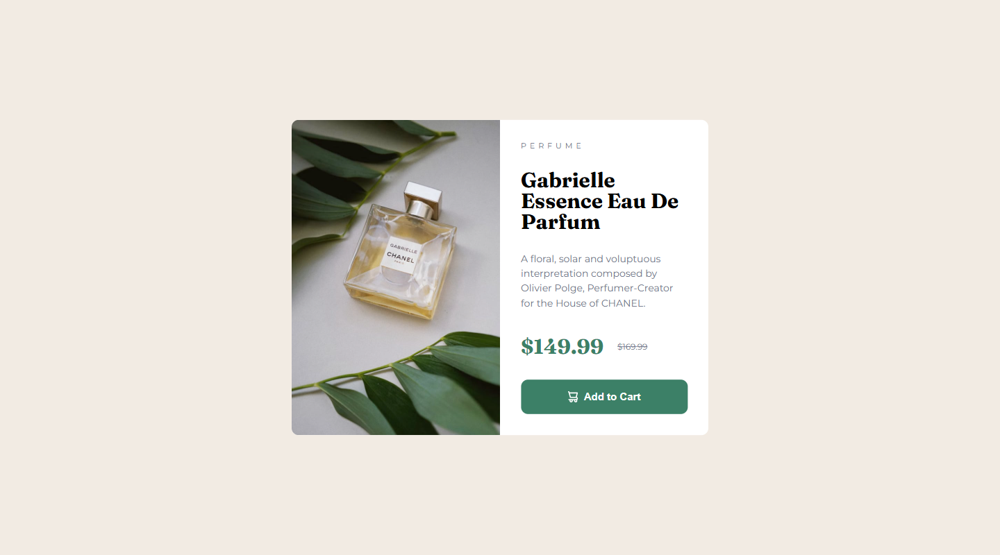

# Frontend Mentor - Product preview card component solution

This is a solution to the [Product preview card component challenge on Frontend Mentor](https://www.frontendmentor.io/challenges/product-preview-card-component-GO7UmttRfa). Frontend Mentor challenges help you improve your coding skills by building realistic projects.

## Table of contents

- [Overview](#overview)
  - [The challenge](#the-challenge)
  - [Screenshot](#screenshot)
  - [Links](#links)
- [My process](#my-process)
  - [Built with](#built-with)
  - [What I learned](#what-i-learned)
- [Author](#author)

## Overview

### The challenge

Users should be able to:

- View the optimal layout depending on their device's screen size
- See hover and focus states for interactive elements

### Screenshot

#### Desktop

#### Mobile

### Links

- Solution URL: [Frontend Mentor](https://www.frontendmentor.io/solutions/product-preview-card-using-css-grid-YMDySi056w)
- Live Site URL: [GitHub](https://anhvu1012.github.io/Product-preview-card/)

## My process

### Built with

- Semantic HTML5 markup
- CSS custom properties
- Flexbox
- CSS Grid
- Mobile-first workflow

### What I learned

I learned how to work in a mobile-first workflow. It's so much easier to implement the mobile version first and then work on the desktop version later on because it won't cause any major problem when e.g. resizing etc.

## Author

- Frontend Mentor - [@anhvu1012](https://www.frontendmentor.io/profile/anhvu1012)
